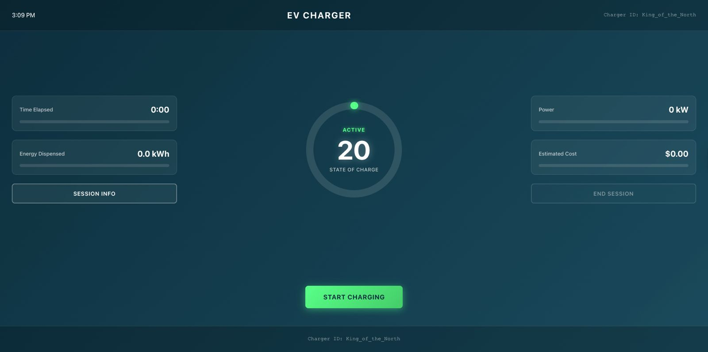

# EV Charger Simulator



## Abstract

A simple React-based simulator for an EV charging station that connects to a backend. The simulator displays real-time charging data including State of Charge (SOC), power, voltage, current, and temperature, while automatically sending charge updates to the backend API every second.

The simulator generates realistic mock charging data using an algorithm that mimics real EV charging behavior. The **State of Charge (SOC)** starts at 20% and increases by 1-2% per second until reaching 90%, simulating a typical fast-charging session. The **power output** follows a realistic charging curve: it starts at maximum capacity (~50 kW) and gradually tapers as the battery approaches higher SOC levels, with more aggressive tapering after 60% to protect battery health. **Voltage** varies realistically between 380-420V (typical for DC fast charging), while **current** is dynamically calculated from power and voltage using Ohm's law (I = P/V). **Battery temperature** gradually increases over time to simulate the heat generated during charging. All numeric values are rounded to 2 decimal places before being sent to the backend API. 

## Local Development Setup

### 1. Navigate to Project Directory

```bash
cd charger-sim
```

### 2. Install Node Version (if using nvm)

```bash
nvm use 20.19.4
```

If you don't have Node 20.19.4 installed:
```bash
nvm install 20.19.4
nvm use 20.19.4
```

### 3. Install Dependencies

```bash
npm install
```

### 4. Configure API Endpoint (Optional)

By default, the app uses a Vite proxy in development that forwards `/api/*` requests to `http://localhost:8000`. 

If your backend runs on a different URL, create a `.env` file in the project root:

```bash
# .env
VITE_API_BASE_URL=http://localhost:8000
```

### 5. Start the Development Server

```bash
npm run dev
```

The app will be available at `http://localhost:5173` (or the next available port).

### 6. Start Your Backend API

Make sure your FastAPI backend is running on `http://localhost:8000` before starting a charging session.

## Project Structure

```
charger-sim/
├── api_schema.json          # OpenAPI schema for the backend API
├── src/
│   ├── App.tsx              # Main simulator component
│   ├── App.css             # Styling for the EV charger UI
│   ├── api.ts              # API client functions
│   ├── main.tsx            # React entry point
│   └── index.css           # Global styles
├── public/                 # Static assets
├── vite.config.ts          # Vite configuration with API proxy
├── package.json            # Dependencies and scripts
├── tsconfig.json           # TypeScript configuration
├── .env                    # Environment variables (optional)
└── README.md               # This file
```

## API Integration

The simulator communicates with the FastAPI backend using two main endpoints:

### 1. Start Charge Session

**Endpoint**: `POST /start_charge`

**Request Payload**:
```json
{
  "started_at": "2024-12-03T14:30:00.000Z",
  "soc_start": 0.2
}
```

**Response**:
```json
{
  "transaction_id": "550e8400-e29b-41d4-a716-446655440000"
}
```

**Example**:
```bash
curl -X POST http://localhost:8000/start_charge \
  -H "Content-Type: application/json" \
  -d '{
    "started_at": "2024-12-03T14:30:00.000Z",
    "soc_start": 0.2
  }'
```

### 2. Send Charge Update

**Endpoint**: `POST /{transaction_id}/charge_update`

**Request Payload**:
```json
{
  "sample_time_increment": 10,
  "soc": 0.25,
  "temp_c": 22.5,
  "avg_power_w": 45000.0,
  "avg_current_a": 112.5,
  "avg_voltage_v": 400.0
}
```

**Response**: `201 Created` (empty body)

**Example**:
```bash
curl -X POST http://localhost:8000/550e8400-e29b-41d4-a716-446655440000/charge_update \
  -H "Content-Type: application/json" \
  -d '{
    "sample_time_increment": 10,
    "soc": 0.25,
    "temp_c": 22.5,
    "avg_power_w": 45000.0,
    "avg_current_a": 112.5,
    "avg_voltage_v": 400.0
  }'
```

### Payload Field Descriptions

| Field | Type | Description | Example |
|-------|------|-------------|---------|
| `started_at` | string (ISO 8601) | Timestamp when charging started | `"2024-12-03T14:30:00.000Z"` |
| `soc_start` | number (0-1) | Initial state of charge (0.0 to 1.0) | `0.2` (20%) |
| `sample_time_increment` | integer | Time interval in seconds between updates | `10` |
| `soc` | number (0-1) | Current state of charge | `0.25` (25%) |
| `temp_c` | number | Battery temperature in Celsius | `22.5` |
| `avg_power_w` | number | Average power in Watts | `45000.0` (45 kW) |
| `avg_current_a` | number | Average current in Amperes | `112.5` |
| `avg_voltage_v` | number | Average voltage in Volts | `400.0` |

## How It Works

1. **Start Session**: Click "START CHARGING" to initiate a charging session
   - Sends `POST /start_charge` with initial SOC (20%) and timestamp
   - Receives a `transaction_id` from the backend

2. **Automatic Updates**: Every 10 seconds, the simulator:
   - Generates realistic charging data (SOC increases, power tapers near 80%+)
   - Calculates energy dispensed and estimated cost
   - Sends `POST /{transaction_id}/charge_update` with current metrics

3. **End Session**: Click "END SESSION" to stop charging
   - Stops the update interval
   - Resets all metrics to initial values

## Simulation Details

The simulator generates realistic EV charging behavior:

- **Initial SOC**: 20% (0.2)
- **Target SOC**: 90% (0.9)
- **Power Curve**: Starts at ~50 kW, tapers as SOC increases (especially after 60%)
- **Voltage Range**: 380-420V (typical for DC fast charging)
- **Temperature**: Gradually increases from 20°C
- **Update Interval**: 10 seconds

## Technologies

- React (v19.2.0)
- TypeScript (v5.9.3)
- Vite (v7.2.4)
- React DOM (v19.2.0)
- ESLint (v9.39.1)

## License

This project is for educational purposes.

